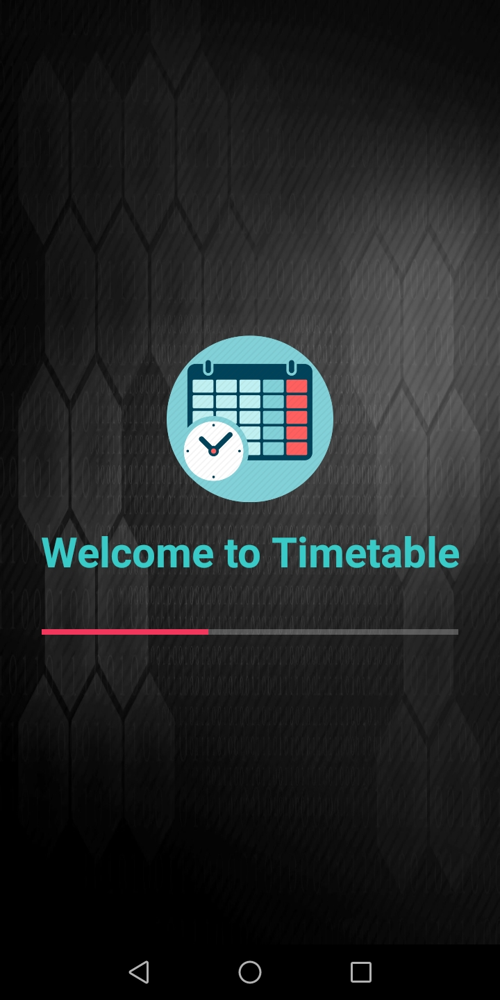

<html>
  <body>
  <h3>Time Table Application</h3>
  

	Time table is an android based application. It is used to maintain your daily routine. You can easily insert, update and delete your information from here.
  

    

      
      
    

    

      
      
    

    

      
    

  </body>
</html>